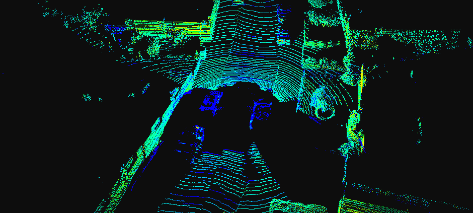

# visualization_3d_points
3D LiDAR points visualization (Python)



This is a repo for real-time visualization of LiDAR 3D points
with Mayavi.

#### Requirements
- mayavi >= 4.7.0
- vtk >= 8.1.2

#### Examples

```python
git clone https://github.com/ZhaoL0/visualization_3d_points.git
cd visualization_3d_points/src

python visualize.py --data_path ${DATA_PATH}
```

#### Thanks
[Eduardo Arnold's blog](https://earnold.me/post/mayavilidar/)

[mayavi documentation](https://docs.enthought.com/mayavi/mayavi/index.html)